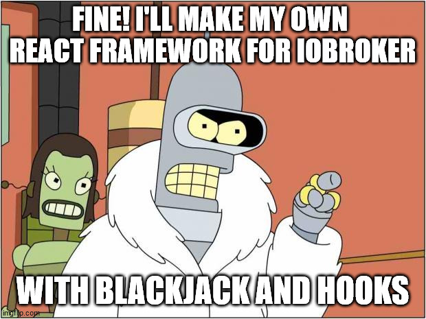

# ioBroker-React



The official React docs [recommend using functional components to compose the UI](https://reactjs.org/docs/composition-vs-inheritance.html), rather than relying on class components with inheritance:

> At Facebook, we use React in thousands of components, and we haven’t found any use cases where we would recommend creating component inheritance hierarchies.

So, this library is an alternative approach to https://github.com/ioBroker/adapter-react-v5/ using a functional style for the main [`App` components](components/index.md). In 
addition, it includes several [Hooks](hooks/index.md) which make writing ioBroker UIs much easier. Sorry, no Blackjack though!

```tsx
import React from "react";
import ReactDOM from "react-dom";

import { IoBrokerApp } from "iobroker-react/app";
import { useAdapter, useGlobals, useI18n } from "iobroker-react/hooks";
import type { Translations } from "iobroker-react/i18n";

// Load your translations
const translations: Translations = {
	en: require("./i18n/en.json"),
	de: require("./i18n/de.json"),
	// ... other translations
};

// This is the main component of your adapter/UI
// In this example, it renders an information if your adapter process is currently running.
const Root: React.FC = React.memo(() => {
	// The alive variable is synchronized with the state `system.adapter.my-adapter.0.alive`
	const { alive } = useAdapter();
	const { namespace } = useGlobals();
	const { translate: _ } = useI18n();

	return (
		<>
			<h1>{_("Hello World!")}</h1>
			The adapter {namespace} is {alive ? "running" : "not running"}.
		</>
	);
});

// Render the main component in an ioBroker app wrapper, which provides everything needed to communicate with ioBroker
ReactDOM.render(
	<IoBrokerApp name="my-adapter" translations={translations}>
		<Root />
	</IoBrokerApp>,
	document.getElementById("root"),
);
```
