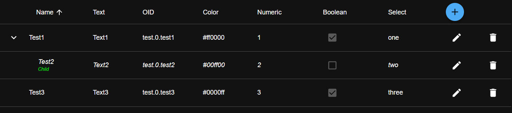

# `TreeTable`

This components displays a table view with tree structure. It is possible to **add** new rows, **edit** and **delete** existing rows and **sort** the displayed rows.



The `TreeTable` has the following props:

```ts
export interface TreeTableProps {
	/** The name under which the table data gets saved in localStorage */
	name?: string;

	/** Definitions for all colunms */
	columns: TreeColumnProps[];
	/** The data to display */
	data: TreeTableRow[];

	/** Gets called when the ADD button is clicked. The parent component must handle adding a new row. */
	onAdd?: () => void;
	/** Gets called when the data was updated */
	onChange?: (data: TreeTableRow[]) => void;

	/** Whether adding new rows is enabled. Requires `allowEdit` to be `true`. Default: `true` */
	allowAdd?: boolean;
	/** Whether editing existing rows is enabled. Default: `true` */
	allowEdit?: boolean;
	/** Whether sorting is enabled. Default: `true` */
	allowSorting?: boolean;
	/** Whether deleting existing rows is enabled. Default: `true` */
	allowDelete?: boolean;

	/** CSS class of the rendered table */
	className?: string;
	/** If true, the row is highlighted when the value is changed */
	glowOnChange?: boolean;

	/** Indentation between levels in pixels */
	indentation?: number;
}
```

Each column has the following props:

```ts
export interface TreeColumnProps {
	/** The title of this column */
	title: string;
	/** Which edit field should be used for this column */
	type?: "string" | "numeric" | "boolean" | "oid" | "color";

	/** Name of this column's field */
	field: string;
	/** Name of this column's sub-field (optional) */
	subField?: string;

	/** CSS style overrides for the header */
	headerStyle?: CSSProperties;
	/** CSS style overrides for cells */
	cellStyle?: CSSProperties;
	/** CSS style overrides for sub-field blocks */
	subStyle?: CSSProperties;

	/** Whether this column is editable. Default: `true` */
	editable?: boolean;
	/** Whether this column is hidden. Default: `false` */
	hidden?: boolean;
	/** Can be used to provide a custom edit component */
	editComponent?: (props: TreeColumnEditComponentProps) => JSX.Element;

	/** When set, a dropdown will be rendered to edit this field */
	options?: Record<string, any>;
	/** When set, a dropdown will be rendered to edit this column's sub-field */
	subFieldOptions?: Record<string, any>;
}
```

And the rows have the following shape:

```ts
export interface TreeTableRow {
	id: string;
	/** Used to nest this row inside another one */
	parentId?: string;
	/** The data for this row */
	[field: string]: any;
}
```

The custom edit component has these props:

```ts
export interface TreeColumnEditComponentProps {
	value: any;
	rowData: TreeTableRow;
	onChange: (newData: TreeTableRow) => void;
}
```

### Adding data to the table with the ADD button

When the ADD button is clicked, the component will call the `onAdd` callback. The parent component must then handle adding a new row to the `data`. To disable adding data, set `allowAdd` to `false`, or disable editing altogether by setting `allowEdit` to `false`.

If you want to create a new line, you have to set the `newLineData` property. This will be used when clicking the `+` button to create a new line.
After creating a new line the `newData` callback function is called. This function gets the new array with the data as parameter.
If you don't need the add button, you can hide it with the `noAdd` property, which must be set to `true`.

### Editing existing rows

By default, all data is editable. To disable this for single columns, set their `editable` property to `false`. To disable editing altogether, set `allowEdit` on the table to `false`.

After a row is edited, the `onChange` callback will be called with the updated data.

### Deleting rows

After a row is deleted, the `onChange` callback will be called with the updated data. To disable deleting rows, set `allowDelete` to `false`.

## `Example`

```tsx
import { TreeTable, TreeColumnProps, TreeTableRow } from "iobroker-react/components";
import React from "react";

const columns: TreeColumnProps[] = [
	{
		title: "Name",
		field: "fieldIdInData",
		editable: true,
		subStyle: { color: "#00FF00" },
		subField: "subFieldData",
	},
	{ title: "Text", field: "text", editable: true, type: "string" },
	{ title: "OID", field: "oid", editable: true, type: "oid" },
	{ title: "Color", field: "color", editable: true, type: "color" },
	{ title: "Numeric", field: "numeric", editable: true, type: "numeric" },
	{ title: "Boolean", field: "boolean", editable: true, type: "boolean" },
	{
		title: "Select",
		field: "select",
		editable: true,
		type: "string",
		options: { 1: "one", 2: "two", 3: "three" },
	},
];

const ExampleComponent: React.FC = () => {
	const [treeData, setTreeData] = React.useState<TreeTableRow[]>([
		{
			id: "1",
			fieldIdInData: "Test1",
			oid: "test.0.test1",
			color: "#ff0000",
			numeric: 1,
			text: "Text1",
			boolean: true,
			select: "1",
		},
		{
			id: "2",
			fieldIdInData: "Test2",
			oid: "test.0.test2",
			color: "#00ff00",
			numeric: 2,
			text: "Text2",
			parentId: "1",
			subFieldData: "Child",
			boolean: false,
			select: "2",
		},
		{
			id: "3",
			fieldIdInData: "Test3",
			oid: "test.0.test3",
			color: "#0000ff",
			numeric: 3,
			text: "Text3",
			boolean: true,
			select: "3",
		},
	]);

	const handleAdd = () => {
		setTreeData(data => [
			...data,
			{
				id: Math.random().toString(36).substr(2, 9), // create random id
				fieldIdInData: "your data",
				oid: "myOID",
				color: "#ff0000",
				numeric: 123,
				select: "number",
				boolean: true,
				text: "your data",
			},
		]);
	};

	return (
		<div>
			<TreeTable
				name="exampleTable"
				columns={columns}
				data={treeData}
				onAdd={handleAdd}
				newData={(data: TreeTableRow[]) => setTreeData(data)}
				indentation={20}
				glowOnChange={true}
			/>
		</div>
	);
};
```
